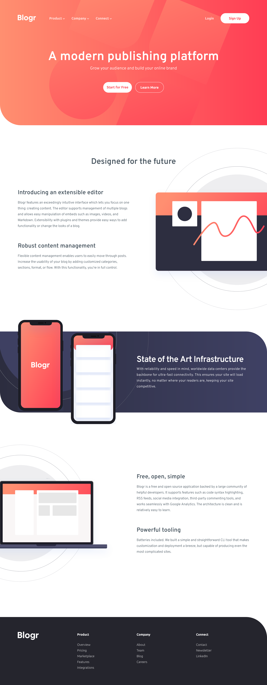

# Frontend Mentor - Blogr landing page solution

This is a solution to the [Blogr landing page challenge on Frontend Mentor](https://www.frontendmentor.io/challenges/blogr-landing-page-EX2RLAApP). Frontend Mentor challenges help you improve your coding skills by building realistic projects.

## Table of contents

- [Overview](#overview)
  - [The challenge](#the-challenge)
  - [Screenshot](#screenshot)
  - [Links](#links)
- [My process](#my-process)
  - [Built with](#built-with)
  - [Useful resources](#useful-resources)
- [Author](#author)

## Overview

### The challenge

Users should be able to:

- View the optimal layout for the site depending on their device's screen size
- See hover states for all interactive elements on the page

### Screenshot

### Links

- Solution URL: [Github](https://github.com/Em3ka/Blogr-page)
- Live Site URL: [Blogr-page](https://fem-blogr-page.netlify.app/)

## My process

### Built with

- Semantic HTML5 markup
- CSS custom properties
- CSS Grid
- Mobile-first workflow

### Useful resources

- [Animate from height zero](https://www.youtube.com/watch?v=B_n4YONte5A&list=LL&index=4) - This helped me figure out how to animate height from zero.
- [Full-bleed wrapper](https://youtu.be/6l24PIccgqU?si=YlsfOcwVW1HDZ0Yo) - This is an amazing video explaining how to setup a full-bleed wrapper. I'd recommend it to anyone still learning this concept.

## Author

- Frontend Mentor - [@em3ka](https://www.frontendmentor.io/profile/em3ka)
